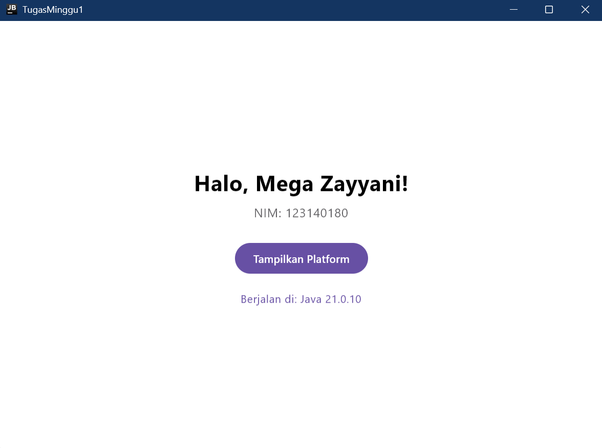
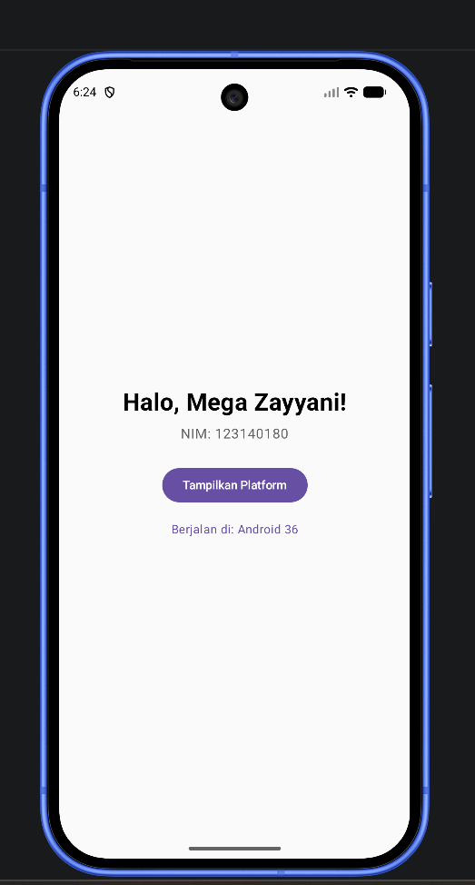

# Tugas Praktikum Minggu 1 - Pengembangan Aplikasi Mobile

**Nama:** Mega Zayyani  
**NIM:** 123140180
**Mata Kuliah:** IF25-22017 Pengembangan Aplikasi Mobile  
**Institut:** Institut Teknologi Sumatera

## Screenshot

### Desktop


### Android


## Cara Menjalankan

```bash
# Desktop
./gradlew :composeApp:run

# Android (butuh emulator aktif)
./gradlew :composeApp:installDebug
```