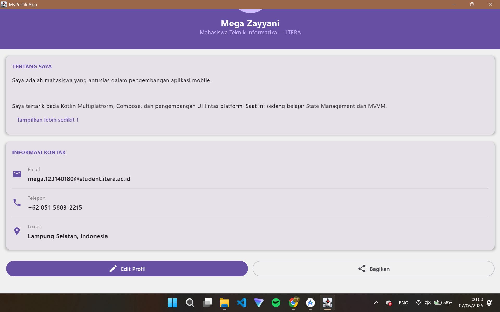
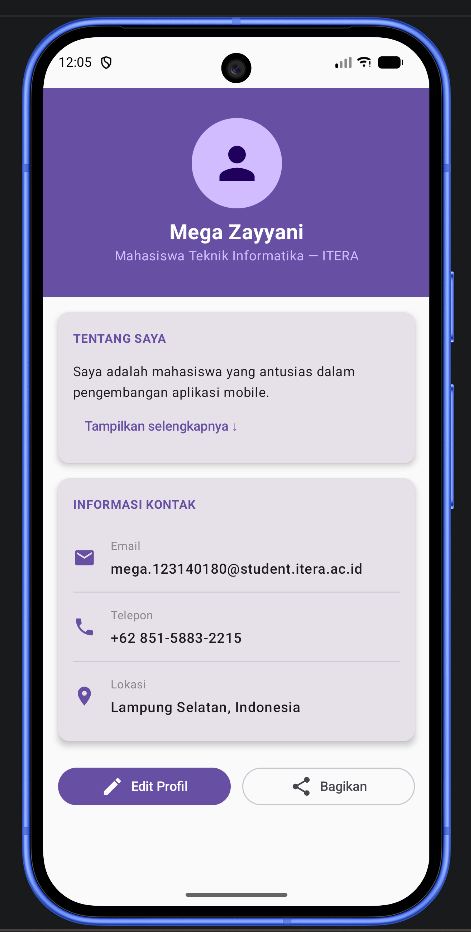

# My Profile App
> Tugas Praktikum 3 — Compose Multiplatform Basics

| | |
|---|---|
| **Nama** | [Nama Lengkap] |
| **NIM** | [NIM] |
| **Mata Kuliah** | IF25-22017 Pengembangan Aplikasi Mobile |
| **Program Studi** | Teknik Informatika — Institut Teknologi Sumatera |

---

## Screenshot

### Desktop


### Android


---

## Fitur yang Diimplementasikan

### Composable Functions (25%)
- `ProfileHeader` — menampilkan foto profil, nama, dan judul menggunakan `Box` + `Column`
- `InfoItem` — menampilkan baris informasi kontak menggunakan `Row` + `Icon` + `Column`
- `ProfileCard` — card reusable dengan `title` dan `content` slot

### Layout (25%)
| Layout | Digunakan pada |
|---|---|
| `Column` | Susunan vertikal seluruh halaman, isi ProfileCard |
| `Row` | InfoItem, tombol aksi Edit & Share |
| `Box` | Avatar di ProfileHeader, header background |

### UI Components (20%)
- `Text` — nama, judul, label, bio, nilai kontak
- `Button` + `OutlinedButton` — tombol Edit Profil dan Bagikan
- `Icon` — avatar, email, telepon, lokasi, tombol aksi
- `Card` — ProfileCard dengan elevasi dan rounded corner

### Modifiers (15%)
- `fillMaxWidth`, `fillMaxSize`, `size` — ukuran komponen
- `padding`, `clip`, `background` — styling dan jarak
- `weight` — distribusi lebar tombol aksi
- `windowInsetsPadding(WindowInsets.statusBars)` — padding status bar Android

### Code Quality (15%)
- Penamaan composable menggunakan PascalCase
- Parameter fungsi dengan tipe yang jelas
- Komentar pada setiap composable function
- Build tanpa error di Android dan Desktop

### Bonus AnimatedVisibility (+10%)
Bagian bio menggunakan `AnimatedVisibility` untuk menampilkan/menyembunyikan teks tambahan dengan tombol toggle.

---

## Cara Menjalankan

### Desktop
```bash
./gradlew desktopRun -DmainClass=MainKt --quiet
```

### Android
Buka project di Android Studio, lalu klik **Run** atau:
```bash
./gradlew :androidApp:assembleDebug
```

---

## Struktur Kode

```
shared/src/commonMain/kotlin/
└── App.kt
    ├── ProfileHeader()   — Composable header dengan foto dan nama
    ├── InfoItem()        — Composable baris informasi kontak
    ├── ProfileCard()     — Composable card reusable
    └── App()             — Fungsi utama yang merangkai semua komponen
```
