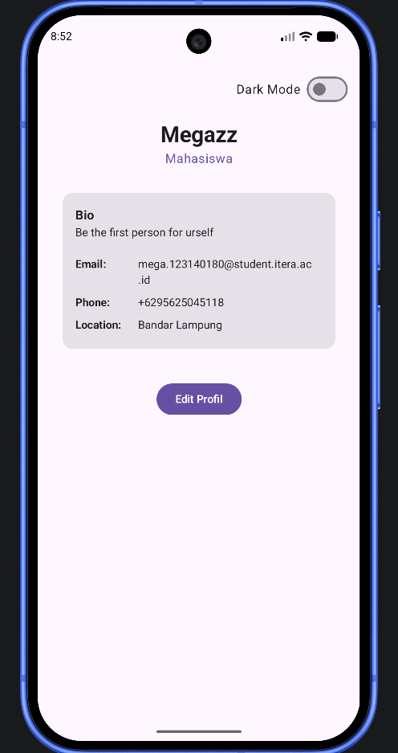
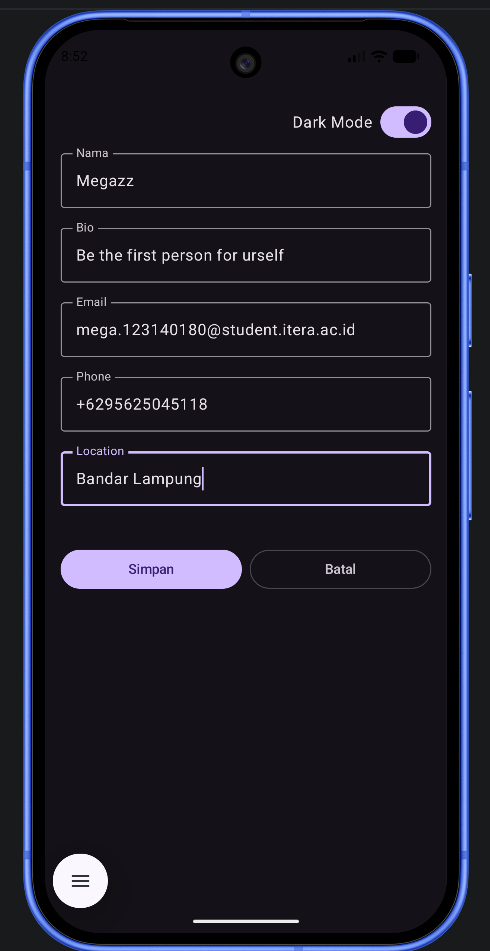

# My Profile App
> Profile App - Tugas Minggu 4

| | |
|---|---|
| **Nama** | Mega Zayyani |
| **NIM** | 123140180 |
| **Mata Kuliah** | IF25-22017 Pengembangan Aplikasi Mobile |
| **Program Studi** | Teknik Informatika — Institut Teknologi Sumatera |

---

## Screenshot

### Light Mode

### Dark Mode

---

## 📖 Deskripsi Project

Profile App merupakan aplikasi profil sederhana yang dikembangkan menggunakan Kotlin Multiplatform dan Compose Multiplatform. Pada praktikum minggu ke-4, aplikasi dikembangkan menggunakan konsep State Management dan MVVM (Model-View-Model).

Aplikasi memungkinkan pengguna untuk:

Melihat informasi profil.
Mengedit nama dan bio profil.
Menyimpan perubahan profil.
Mengaktifkan dan menonaktifkan Dark Mode.
Mengelola state menggunakan ViewModel dan StateFlow.

## ✨ Fitur yang Diimplementasikan
1. MVVM Pattern

Aplikasi menerapkan arsitektur Model-View-ViewModel (MVVM):

Model → Menyimpan data profil.
ViewModel → Mengelola state dan business logic.
View (Compose UI) → Menampilkan data dan menerima interaksi pengguna.
2. UI State Pattern

Seluruh kondisi UI disimpan dalam satu objek ProfileUiState, yang berisi:

Data profil
Status edit profil
Input nama sementara
Input bio sementara

Pendekatan ini menerapkan prinsip Single Source of Truth, sehingga state aplikasi tetap konsisten.

3. Edit Profile

Pengguna dapat:

Menekan tombol Edit Profil
Mengubah nama dan bio
Menyimpan perubahan
Membatalkan proses edit

Perubahan data akan langsung memperbarui tampilan profil.

4. State Hoisting

Komponen input dibuat stateless:

LabeledTextField
ProfileScreen

State disimpan di ProfileViewModel dan diteruskan ke composable melalui parameter dan callback.

5. Dark Mode

Aplikasi menyediakan fitur:

Toggle Dark Mode menggunakan Switch
Tema berubah secara otomatis
State tema disimpan di ViewModel
---

## Cara Menjalankan

### ▶️ Cara Menjalankan Project
Android
1. Buka project menggunakan Android Studio.
2. Tunggu proses Gradle Sync selesai.
3. Pilih konfigurasi androidApp.
4. Jalankan aplikasi menggunakan emulator atau perangkat Android.
