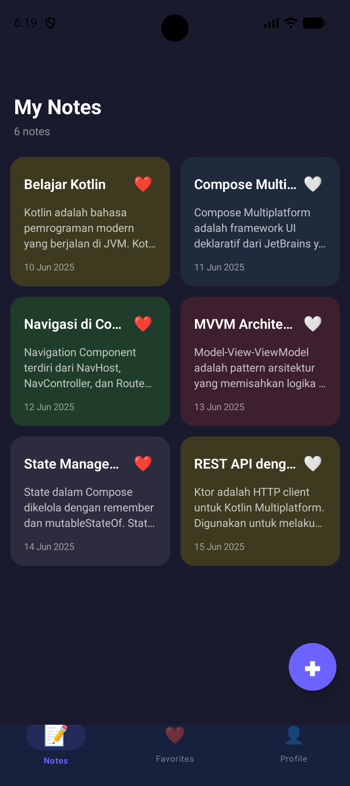
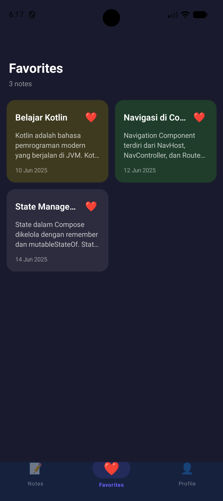
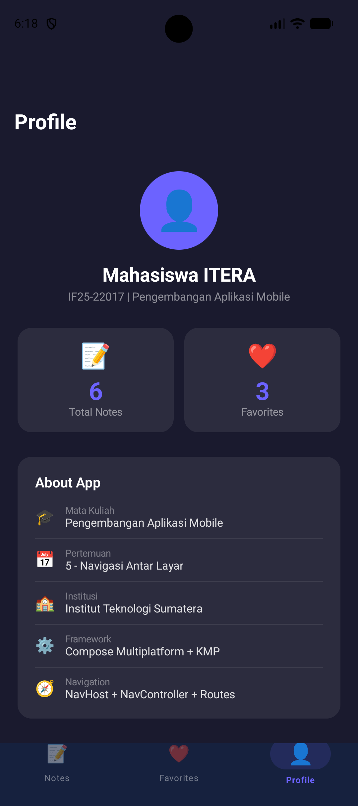
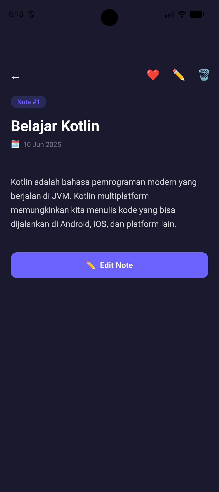
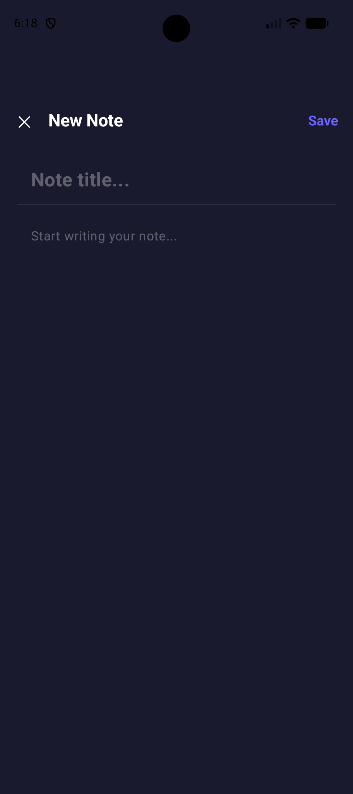
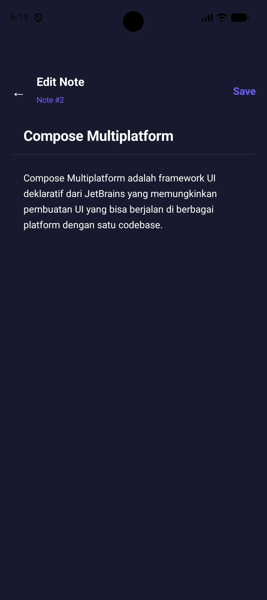

# 📝 Notes App — Tugas Praktikum Pertemuan 5

| | |
|---|---|
| **Nama** | Mega Zayyani |
| **NIM** | 123140180 |
| **Mata Kuliah** | IF25-22017 Pengembangan Aplikasi Mobile |
| **Program Studi** | Teknik Informatika — Institut Teknologi Sumatera |

---

## 🗂️ Struktur Folder

```
composeApp/src/commonMain/kotlin/com/example/notesapp/
├── navigation/
│   ├── AppNavigation.kt     ← NavHost utama + Bottom Navigation
│   ├── BottomNavItem.kt     ← Sealed class untuk 3 tab
│   └── Screen.kt            ← Sealed class untuk semua routes
├── screens/
│   ├── NotesScreen.kt       ← Tab 1: Daftar semua catatan
│   ├── FavoritesScreen.kt   ← Tab 2: Catatan favorit
│   ├── ProfileScreen.kt     ← Tab 3: Profil & statistik
│   ├── NoteDetailScreen.kt  ← Detail catatan (menerima noteId)
│   ├── AddNoteScreen.kt     ← Tambah catatan baru
│   └── EditNoteScreen.kt    ← Edit catatan (menerima noteId)
├── components/
│   └── NoteCard.kt          ← Reusable card component
├── model/
│   └── Note.kt              ← Data class Note
├── viewmodel/
│   └── NotesViewModel.kt    ← State management dengan StateFlow
└── App.kt                   ← Entry point
```

---

## 🧭 Navigation Flow Diagram

```
┌─────────────────────────────────────────────────────────┐
│              BOTTOM NAVIGATION TABS                      │
│  ┌──────────┐    ┌────────────┐    ┌──────────────┐     │
│  │ 📝 Notes │    │ ❤️ Favorites│    │  👤 Profile  │     │
│  └──────────┘    └────────────┘    └──────────────┘     │
└─────────────────────────────────────────────────────────┘
         │                  │
         ▼                  ▼
   ┌──────────┐       ┌──────────┐
   │ Note List│       │ Fav List │
   └────┬─────┘       └────┬─────┘
        │ click             │ click
        ▼                   │
  ┌───────────────┐         │
  │ Note Detail   │◄────────┘
  │ (noteId: Int) │
  └──────┬────────┘
         │ Edit button
         ▼
  ┌───────────────┐
  │ Edit Note     │
  │ (noteId: Int) │
  └───────────────┘

  FAB (+) → Add Note
```

**Keterangan:**
- `→` = `navigate()` (maju)
- `←` = `popBackStack()` (kembali)
- Tab switch = `popUpTo + launchSingleTop + restoreState`
- Arguments: `noteId (Int)` diteruskan ke Detail dan Edit screen

---

## 🚀 Cara Setup & Menjalankan

### Prasyarat
- Android Studio Hedgehog (2023.1.1) atau lebih baru
- JDK 11 atau 17
- Android SDK API 24+
- (Opsional untuk iOS) Xcode 15+, macOS

### Langkah 1: Buat Project Baru dari Template KMP

1. Buka browser, pergi ke: **https://kmp.jetbrains.com**
2. Isi konfigurasi:
   - **Project Name:** `NotesApp`
   - **Project ID:** `com.example.notesapp`
   - **Android:** ✅ dicentang
   - **iOS:** ✅ dicentang (pilih **Compose** untuk iOS UI)
   - **Include Tests:** ✅ dicentang
3. Klik **Download**
4. Extract file ZIP yang didownload
5. Buka Android Studio → **File > Open** → pilih folder hasil extract

### Langkah 2: Salin Kode dari Repository

Ganti/tambahkan file berikut ke dalam project sesuai struktur di atas:

**a. Update `gradle/libs.versions.toml`** — tambahkan dependency navigation:
```toml
[versions]
navigation-compose = "2.8.0-alpha10"
androidx-lifecycle = "2.8.4"

[libraries]
navigation-compose = { module = "org.jetbrains.androidx.navigation:navigation-compose", version.ref = "navigation-compose" }
androidx-lifecycle-viewmodel = { module = "org.jetbrains.androidx.lifecycle:lifecycle-viewmodel-compose", version.ref = "androidx-lifecycle" }
androidx-lifecycle-runtime-compose = { module = "org.jetbrains.androidx.lifecycle:lifecycle-runtime-compose", version.ref = "androidx-lifecycle" }
```

**b. Update `composeApp/build.gradle.kts`** — tambahkan di `commonMain.dependencies`:
```kotlin
implementation(libs.navigation.compose)
implementation(libs.androidx.lifecycle.viewmodel)
implementation(libs.androidx.lifecycle.runtime.compose)
```

**c. Buat folder** `navigation/`, `screens/`, `components/`, `model/`, `viewmodel/` di dalam:
```
composeApp/src/commonMain/kotlin/com/example/notesapp/
```

**d. Salin semua file** `.kt` dari repository ke folder yang sesuai.

**e. Update `App.kt`** (sudah ada di template, ganti isinya):
```kotlin
@Composable
fun App() {
    AppNavigation()
}
```

### Langkah 3: Sync dan Build

1. Klik **"Sync Now"** di notifikasi gradle (pojok kanan atas)
2. Tunggu proses sync selesai (bisa 3–5 menit pertama kali)
3. Jika ada error, cek bagian Troubleshooting di bawah

### Langkah 4: Jalankan di Android

**Via Emulator:**
1. Buka **Device Manager** (ikon HP di toolbar)
2. Klik **Create Virtual Device**
3. Pilih **Pixel 6** → **Next**
4. Pilih sistem operasi **API 35 (Android 15)** → **Download** jika belum ada → **Next**
5. Klik **Finish**
6. Pilih emulator dari dropdown di toolbar → klik tombol ▶️ (Run)

**Via Device Fisik:**
1. Aktifkan **Developer Options** di HP (Settings → About Phone → tap Build Number 7x)
2. Aktifkan **USB Debugging**
3. Hubungkan HP ke komputer via USB
4. Pilih device dari dropdown → klik ▶️

---

## 📸 Screenshot

Berikut semua screen untuk dokumentasi README:

| No | Screen | Hasil Screenshot |
|----|--------|-------------|
| 1 | **Notes List** | 
 |
| 2 | **Favorites** | |
| 3 | **Profile** |  |
| 4 | **Note Detail** |  |
| 5 | **Add Note** |  |
| 6 | **Edit Note** |  |


---

## 🎥 Link video demo
[link video demo](https://youtube.com/shorts/0a6MADKwTD8)

---