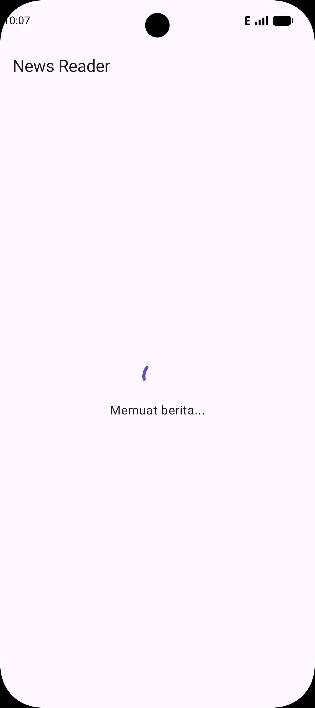
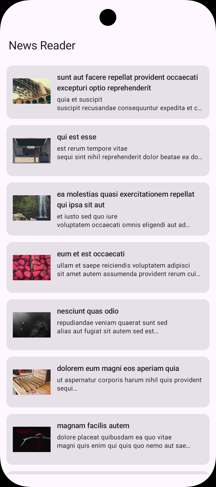
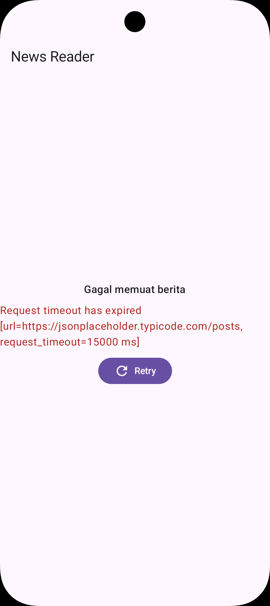
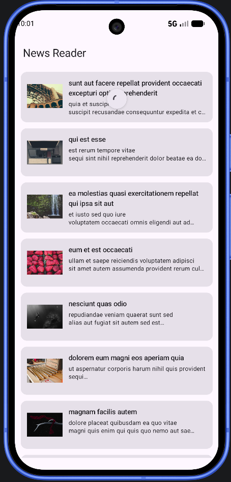
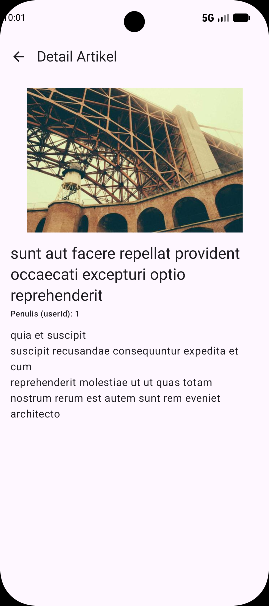

# Tugas Minggu 6 - News Reader

| | |
|---|---|
| **Nama** | Mega Zayyani |
| **NIM** | 123140180 |
| **Mata Kuliah** | IF25-22017 Pengembangan Aplikasi Mobile |
| **Program Studi** | Teknik Informatika — Institut Teknologi Sumatera |

## Cara Menjalankan Aplikasi

1. Clone / extract project ini, lalu buka dengan Android Studio.
2. Tunggu proses **Sync Project with Gradle Files** selesai.
3. Pastikan permission internet sudah ada di `composeApp/src/androidMain/AndroidManifest.xml`:
   ```xml
   <uses-permission android:name="android.permission.INTERNET" />
   ```
4. Jalankan emulator Android (atau hubungkan HP fisik via USB debugging).
5. Pilih run configuration **`composeApp`**, klik tombol ▶️ **Run**.
6. App akan fetch data artikel dari API otomatis saat pertama kali dibuka.

### Menguji tiap state
- **Loading**: muncul otomatis sesaat saat app pertama dibuka / saat refresh.
- **Success**: muncul setelah data berhasil di-fetch, tampil sebagai list artikel.
- **Error**: matikan koneksi internet emulator/HP, lalu buka ulang app atau tekan Retry.
- **Refresh**: tarik (swipe down) list artikel ke bawah untuk memicu pull-to-refresh.
- **Detail**: tap salah satu artikel di list untuk membuka detail screen.

## Struktur Folder

```
composeApp/src/commonMain/kotlin/org/app/newsreader/project/
├── App.kt
├── data/
├── navigation/
└── ui/
```

| Folder/File | Penjelasan singkat |
|---|---|
| `App.kt` | Root composable yang merangkai HttpClient, Repository, dan NavHost jadi satu aplikasi. |
| `data/` | Berisi model data, HTTP client, dan repository untuk komunikasi dengan API. |
| `navigation/` | Berisi definisi route/path navigasi antar screen. |
| `ui/` | Berisi UI state dan composable screen (list, detail, viewmodel). |

## Screenshot

### Loading State


### Success State


### Error State


### Refresh (Pull-to-Refresh)


### Detail Card



## Link Demo Video

https://youtube.com/shorts/9K1wWCZhpto