# 📝 Notes App — Tugas Praktikum Minggu 7
**IF25-22017 Pengembangan Aplikasi Mobile | Institut Teknologi Sumatera**

| | |
|---|---|
| **Nama** | Mega Zayyani |
| **NIM** | 123140180 |
| **Mata Kuliah** | IF25-22017 Pengembangan Aplikasi Mobile |
| **Program Studi** | Teknik Informatika — Institut Teknologi Sumatera |

---

## 📋 Deskripsi

Upgrade dari Notes App Minggu 5 dengan tambahan:
- 🗄️ **SQLDelight** — database lokal yang persisten
- ⚙️ **DataStore/Settings** — menyimpan preferensi pengguna
- 🔍 **Search** — mencari catatan berdasarkan judul/konten
- ⭐ **Favorit** — tandai catatan sebagai favorit
- 📴 **Offline-First** — semua data tersimpan lokal
- Dan garis besar aplikasi seperti color palette dan layout aplikasi

---

## 🗃️ Database Schema

```sql
CREATE TABLE NoteEntity (
    id          INTEGER PRIMARY KEY AUTOINCREMENT,
    title       TEXT    NOT NULL,
    content     TEXT    NOT NULL,
    is_favorite INTEGER NOT NULL DEFAULT 0,   -- 0=false, 1=true
    created_at  INTEGER NOT NULL,             -- epoch milliseconds
    updated_at  INTEGER NOT NULL              -- epoch milliseconds
);

CREATE INDEX idx_note_updated  ON NoteEntity(updated_at DESC);
CREATE INDEX idx_note_favorite ON NoteEntity(is_favorite);
```

### Queries yang tersedia:
| Query | Fungsi |
|-------|--------|
| `selectAll` | Ambil semua notes |
| `selectFavorites` | Ambil notes favorit saja |
| `selectById` | Ambil note berdasarkan ID |
| `search(q, q)` | Cari di judul dan konten |
| `insert` | Tambah note baru |
| `update` | Edit note |
| `toggleFavorite` | Toggle status favorit |
| `delete` | Hapus note |

---

## 🏗️ Arsitektur

```
UI (Compose)
     ↓
ViewModel (NotesViewModel)
     ↓
Repository (NoteRepository)
     ↓
SQLDelight Database (notes.db)
```

**Settings Flow:**
```
SettingsScreen → NotesViewModel → SettingsManager → multiplatform-settings
```

---

## 📁 Struktur File

```
composeApp/src/
├── commonMain/
│   ├── kotlin/com/notes/app/
│   │   ├── data/
│   │   │   ├── db/DatabaseDriverFactory.kt      ← expect/actual
│   │   │   ├── repository/NoteRepository.kt     ← CRUD + Flow
│   │   │   └── settings/SettingsManager.kt      ← DataStore
│   │   ├── domain/model/
│   │   │   └── Note.kt                          ← Data class
│   │   └── presentation/
│   │       ├── AppNavigation.kt                 ← NavHost
│   │       ├── Screen.kt                        ← Route definitions
│   │       ├── screens/
│   │       │   ├── NotesScreen.kt               ← List + Search
│   │       │   ├── FavoritesScreen.kt           ← Favorit
│   │       │   ├── ProfileScreen.kt             ← Profil + Stats
│   │       │   ├── NoteDetailScreen.kt          ← Detail
│   │       │   ├── AddEditNoteScreen.kt         ← Add & Edit
│   │       │   └── SettingsScreen.kt            ← 🆕 Settings
│   │       ├── components/
│   │       │   └── NoteCard.kt                  ← Reusable card
│   │       └── viewmodel/
│   │           └── NotesViewModel.kt            ← State management
│   └── sqldelight/com/notes/app/db/
│       └── Note.sq                              ← SQL schema
├── androidMain/
│   └── DatabaseDriverFactory.android.kt         ← AndroidSqliteDriver
└── iosMain/
    └── DatabaseDriverFactory.ios.kt             ← NativeSqliteDriver
```

---

## 🔄 Navigation Flow

```
[Notes Screen] ──→ [Note Detail] ──→ [Edit Note]
     │
     ├──→ [Add Note]
     └──→ [Settings]

[Profile Screen] ──→ [Settings]

Bottom Nav: Notes ↔ Favorites ↔ Profile
```

---

## 📦 Dependencies Baru (Minggu 7)

```kotlin
// SQLDelight
"app.cash.sqldelight:runtime:2.0.1"
"app.cash.sqldelight:coroutines-extensions:2.0.1"
"app.cash.sqldelight:android-driver:2.0.1"  // androidMain
"app.cash.sqldelight:native-driver:2.0.1"   // iosMain

// multiplatform-settings (DataStore KMP)
"com.russhwolf:multiplatform-settings:1.1.1"
"com.russhwolf:multiplatform-settings-coroutines:1.1.1"
```

---

## 📸 Screenshots

> Screenshot diambil menggunakan Android Emulator

| Screen | Deskripsi |
|--------|-----------|
| 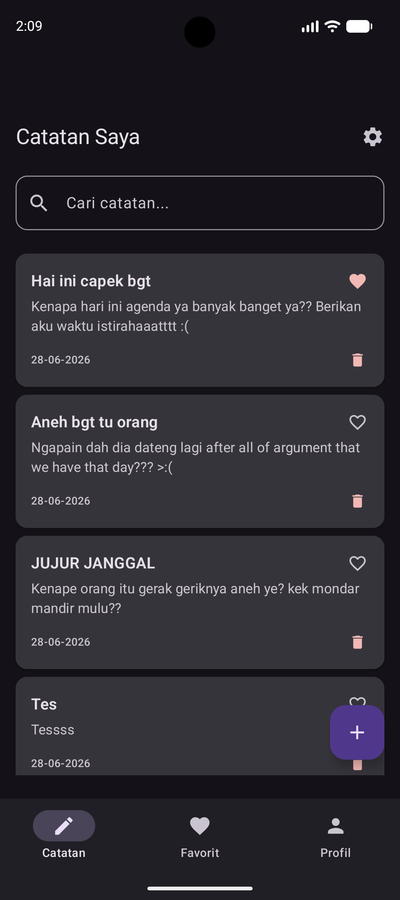 | Layar utama daftar catatan |
| 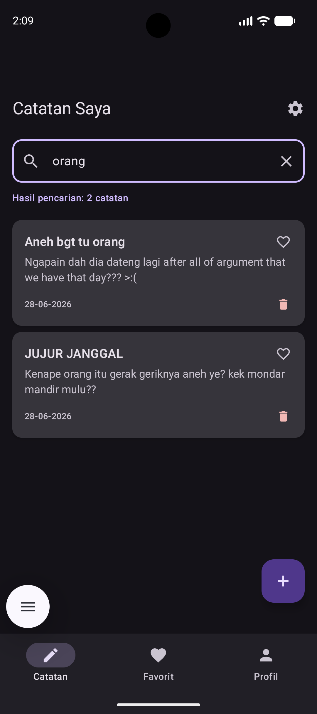 | Fitur pencarian aktif |
| 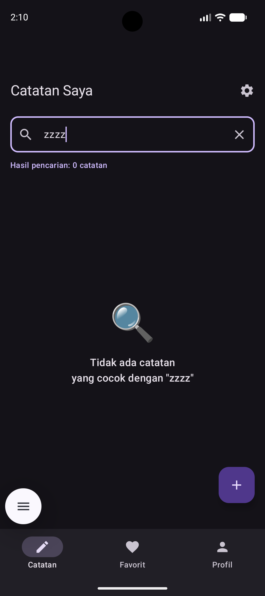 | Empty state |
| 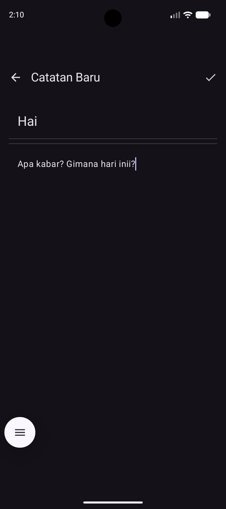 | Form tambah catatan baru |
| 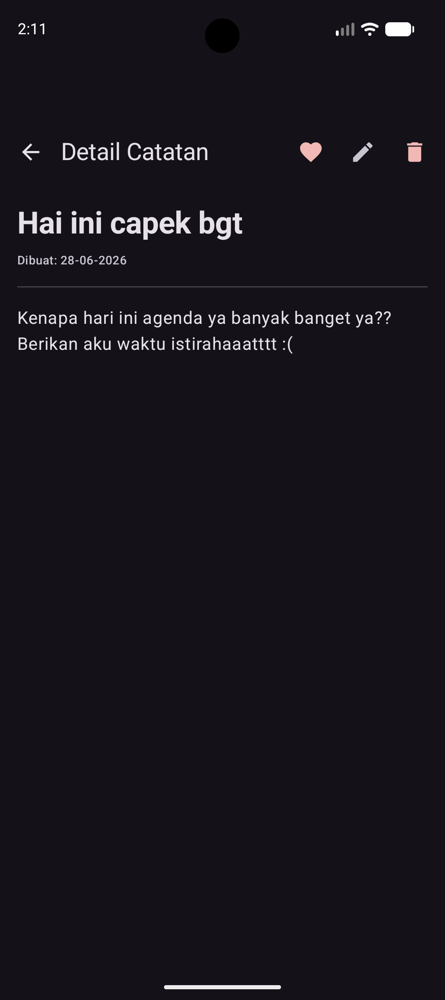 | Detail catatan |
| 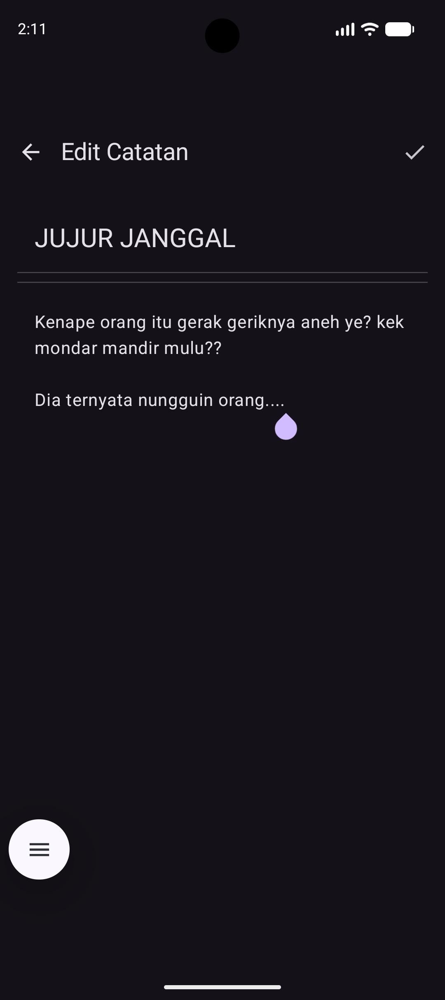 | Form edit catatan |
| 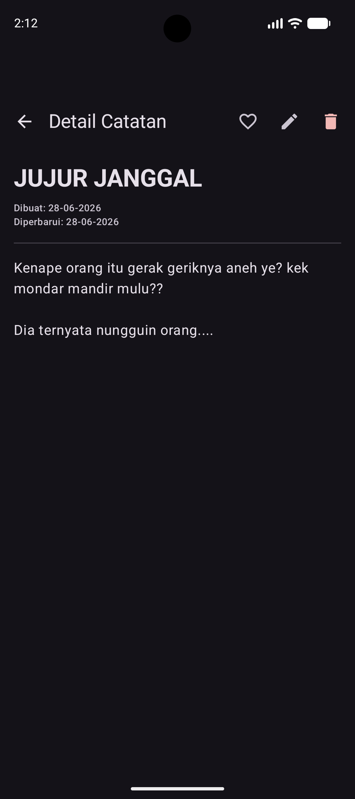 | Hasil edit note |
| 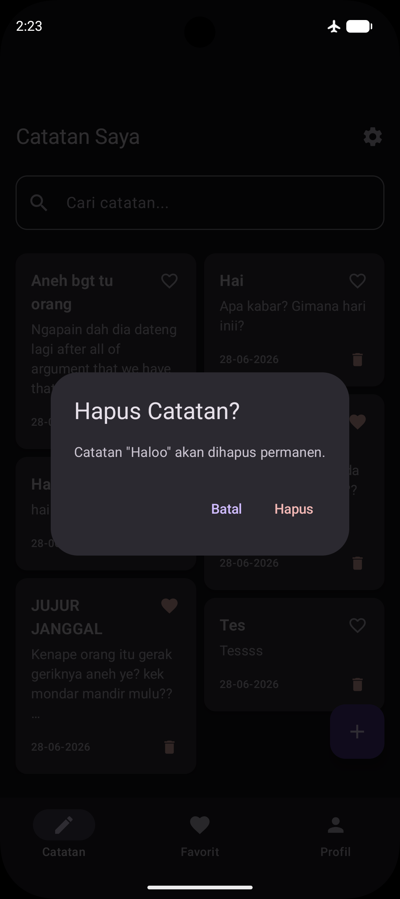 | Delete note |
| 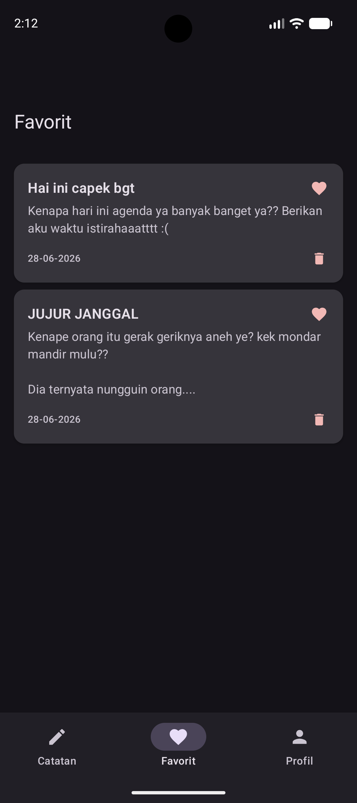 | Daftar catatan favorit |
| 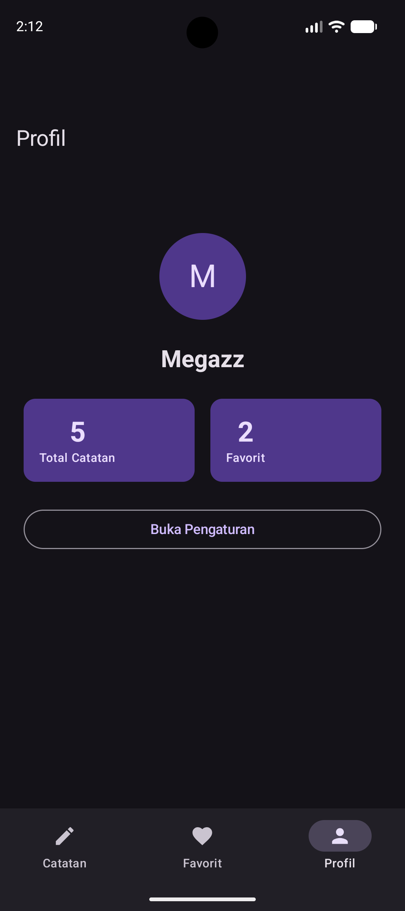 | Halaman profil dengan statistik |
| `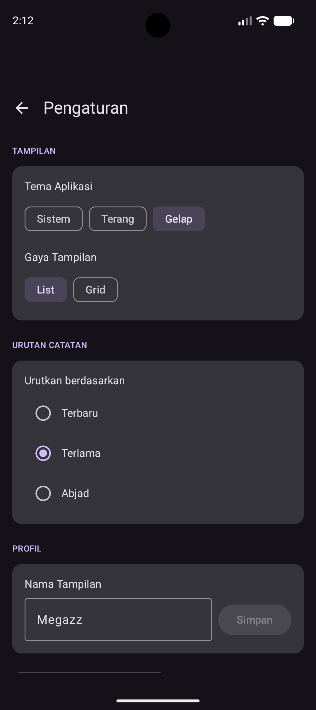 | Halaman pengaturan |
|  | Tema gelap |
| 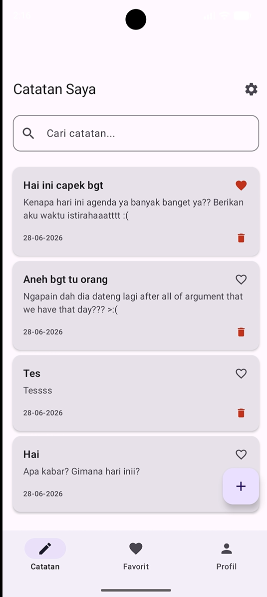 | Tema terang |
| 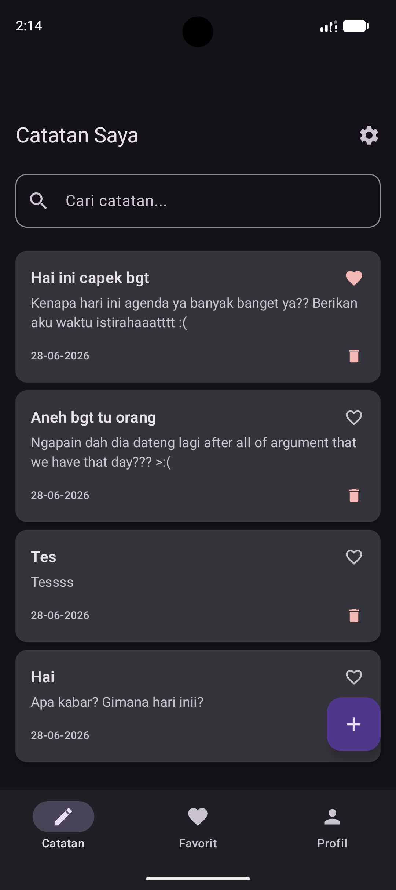 | Mode offline |

---

## Link Video Demo Aplikasi
[link video demo](https://youtube.com/shorts/CbS-PPEszTk)