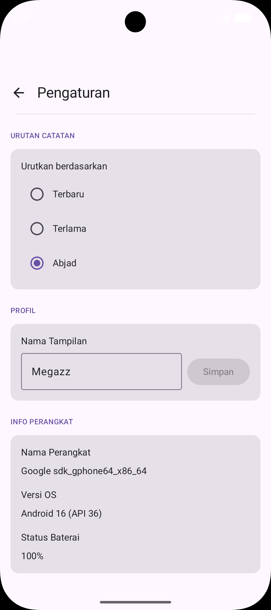
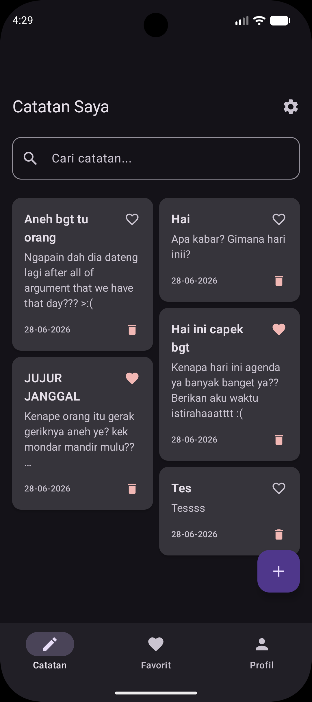
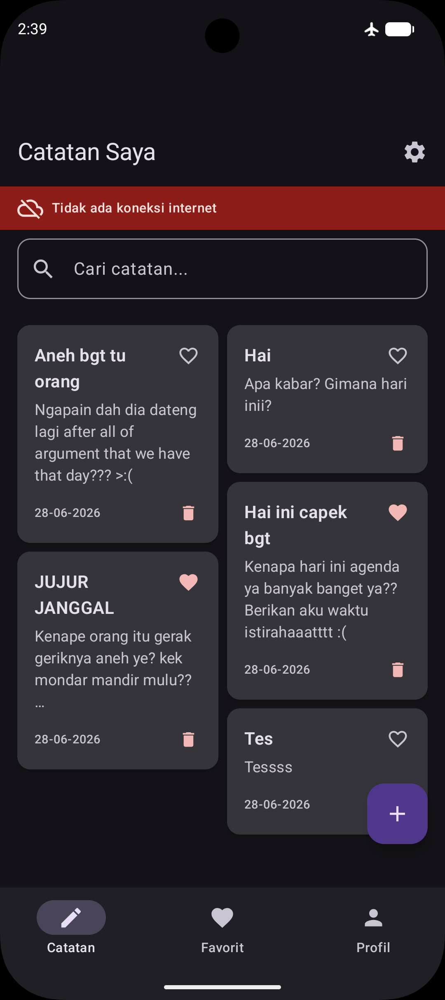

# 📝 Notes App — Tugas Praktikum Minggu 8
**IF25-22017 Pengembangan Aplikasi Mobile | Institut Teknologi Sumatera**

| | |
|---|---|
| **Nama** | Mega Zayyani |
| **NIM** | 123140180 |
| **Mata Kuliah** | IF25-22017 Pengembangan Aplikasi Mobile |
| **Program Studi** | Teknik Informatika — Institut Teknologi Sumatera |

---

## 📋 Deskripsi

Upgrade dari Notes App Minggu 7 dengan tambahan **Platform-Specific Features**:
- 💉 **Koin Dependency Injection** — semua dependency (Repository, SettingsManager, ViewModel, Platform API) di-inject lewat Koin
- 📱 **DeviceInfo (expect/actual)** — nama device & versi OS, ditampilkan di Settings screen
- 📶 **NetworkMonitor (expect/actual)** — indikator status koneksi internet di main screen
- 🔋 **BatteryInfo (expect/actual)** — bonus, status & level baterai di Settings screen
- Layout, flow navigasi, dan color palette aplikasi **tidak diubah** dari Minggu 7

---

## 🏗️ Architecture Diagram

```
                         ┌─────────────────────────┐
                         │   UI (Compose Screens)   │
                         │  NotesScreen · Settings  │
                         └────────────┬─────────────┘
                                      │ koinInject() / koinViewModel()
                                      ▼
                         ┌─────────────────────────┐
                         │   Koin DI Container      │
                         │ (commonModule+platformModule) │
                         └────┬───────────┬─────────┘
                              │           │
              ┌───────────────┘           └───────────────┐
              ▼                                            ▼
   ┌─────────────────────┐                      ┌───────────────────────┐
   │   NotesViewModel      │                     │   Platform APIs        │
   │ (state management)    │                     │ expect/actual:          │
   └──────────┬───────────┘                      │  • DeviceInfo           │
              ▼                                  │  • NetworkMonitor       │
   ┌─────────────────────┐                       │  • BatteryInfo          │
   │ NoteRepository        │                     └───────────┬────────────┘
   │ SettingsManager        │                                 │
   └──────────┬───────────┘                       ┌────────────┴────────────┐
              ▼                                   ▼                          ▼
   ┌─────────────────────┐           ┌──────────────────┐      ┌──────────────────┐
   │ SQLDelight Database   │          │  Android actual    │      │  iOS / JVM actual  │
   │     (notes.db)         │         │ Build / ConnectivityManager │ │ UIDevice / NSUserDefaults │
   └─────────────────────┘           └──────────────────┘      └──────────────────┘
```

**Koin Module Flow:**
```
startKoin { modules(commonModule, platformModule) }
        │
        ├── commonModule    → NoteRepository, SettingsManager, NotesViewModel
        └── platformModule  → DatabaseDriverFactory, NotesDatabase, Settings,
                               DeviceInfo, BatteryInfo, NetworkMonitor
```

---

## 📁 File Baru / Diubah (Minggu 8)

```
composeApp/src/
├── commonMain/kotlin/com/example/notesapp/
│   ├── di/AppModule.kt                  ← 🆕 commonModule + expect platformModule
│   ├── platform/
│   │   ├── DeviceInfo.kt                ← 🆕 expect class
│   │   ├── NetworkMonitor.kt            ← 🆕 expect class
│   │   └── BatteryInfo.kt               ← 🆕 expect class (bonus)
│   ├── App.kt                           ← ✏️ pakai koinViewModel()
│   └── presentation/screens/
│       ├── NotesScreen.kt               ← ✏️ + network status banner
│       └── SettingsScreen.kt            ← ✏️ + section "Info Perangkat"
├── androidMain/kotlin/com/example/notesapp/
│   ├── di/AppModule.android.kt          ← 🆕 actual platformModule
│   └── platform/*.android.kt            ← 🆕 actual DeviceInfo/NetworkMonitor/BatteryInfo
├── iosMain/kotlin/com/example/notesapp/
│   ├── di/AppModule.ios.kt              ← 🆕 actual platformModule
│   ├── MainViewController.kt            ← 🆕 init Koin + entry point
│   └── platform/*.ios.kt                ← 🆕 actual DeviceInfo/NetworkMonitor/BatteryInfo
└── jvmMain/kotlin/com/example/notesapp/
    ├── di/AppModule.jvm.kt              ← 🆕 actual platformModule
    └── platform/*.jvm.kt                ← 🆕 actual DeviceInfo/NetworkMonitor/BatteryInfo
```

---

## 📦 Dependencies Baru (Minggu 8)

```kotlin
// Koin - Dependency Injection
"io.insert-koin:koin-core:4.0.0"
"io.insert-koin:koin-compose:4.0.0"
"io.insert-koin:koin-compose-viewmodel:4.0.0"
"io.insert-koin:koin-android:4.0.0"   // androidMain
```

---

## 📸 Screenshots

> Screenshot diambil menggunakan Android Emulator

| Screen | Deskripsi |
|--------|-----------|
|  | Settings screen menampilkan **Info Perangkat** (nama device, versi OS, status baterai) hasil `DeviceInfo` & `BatteryInfo` (expect/actual) yang di-inject via Koin |
|  | Main screen dalam kondisi online (tidak ada banner) |
|  | Main screen menampilkan banner **"Tidak ada koneksi internet"** hasil `NetworkMonitor` (expect/actual) saat WiFi/data dimatikan |

---

## Link Video Demo Aplikasi
[link video demo](https://youtube.com/shorts/fQ2OeoF9bd8)