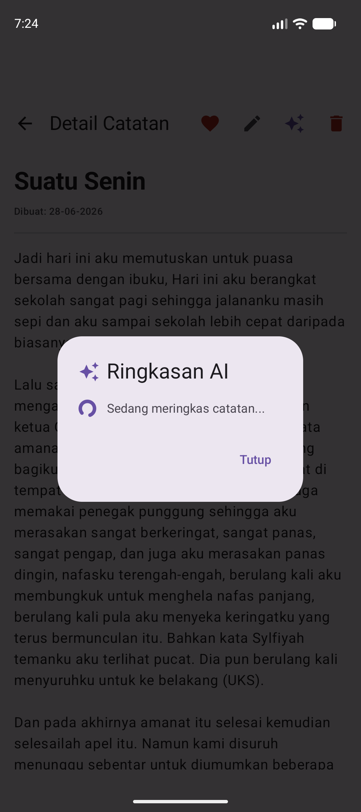
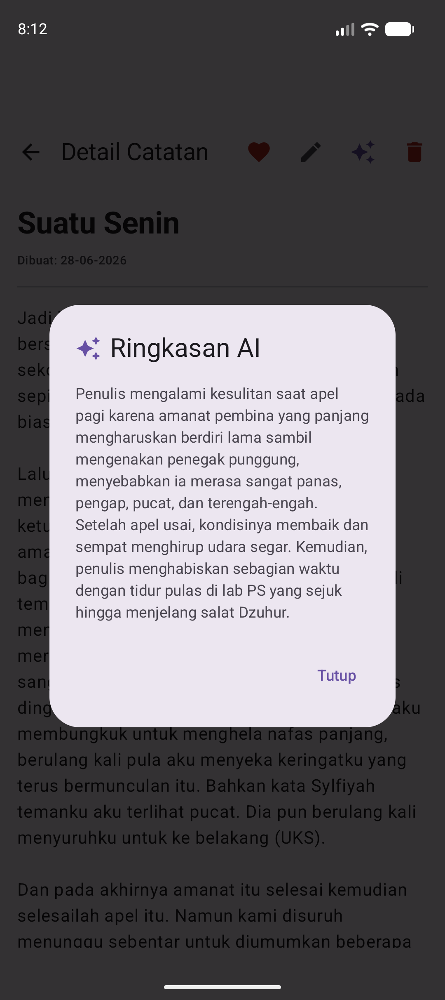
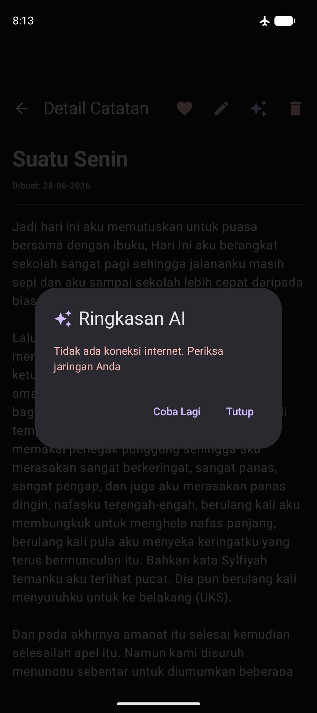
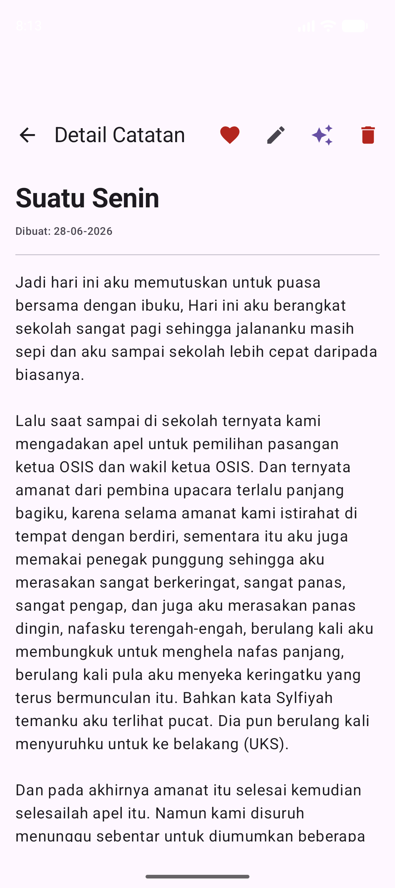
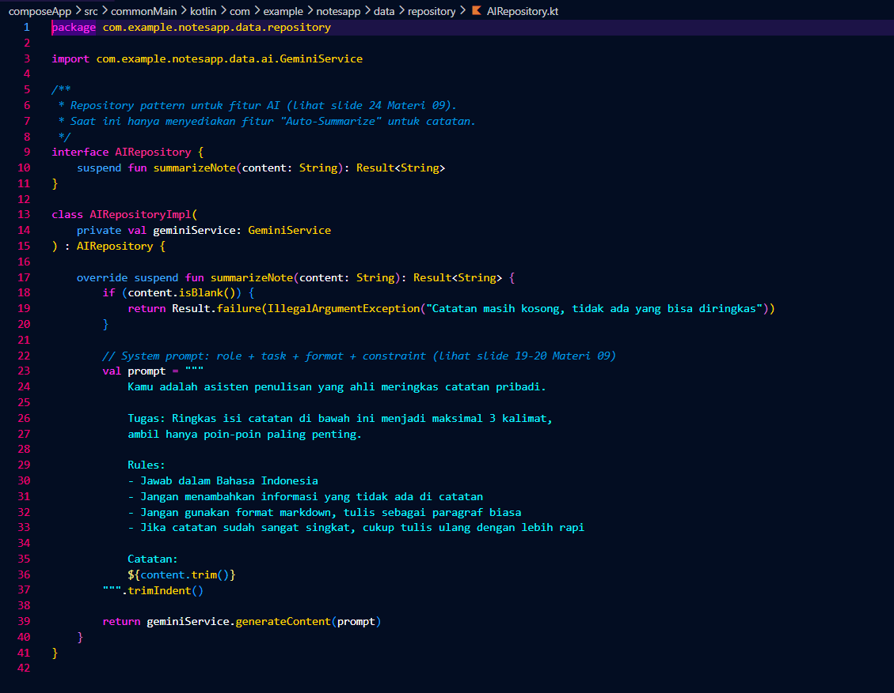

# 📝 Notes App — Tugas Praktikum Minggu 9
**IF25-22017 Pengembangan Aplikasi Mobile | Institut Teknologi Sumatera**

| | |
|---|---|
| **Nama** | Mega Zayyani |
| **NIM** | 123140180 |
| **Mata Kuliah** | IF25-22017 Pengembangan Aplikasi Mobile |
| **Program Studi** | Teknik Informatika — Institut Teknologi Sumatera |

---

## 🤖 Fitur AI — Auto-Summarize (Pertemuan 9)

### Deskripsi
Fitur ini menambahkan kemampuan meringkas isi catatan secara otomatis menggunakan
Google Gemini API (`gemini-2.0-flash`). User dapat menekan tombol ✨ di halaman
Detail Catatan untuk mendapatkan ringkasan maksimal 3 kalimat dari catatan yang
sedang dibuka.

### Cara Pakai
1. Buka salah satu catatan dari halaman utama
2. Tekan ikon ✨ (AutoAwesome) di pojok kanan atas
3. Tunggu beberapa saat (indikator loading akan tampil)
4. Ringkasan akan muncul dalam dialog

---

## 🏗️ Architecture Diagram

```
                         ┌─────────────────────────┐
                         │   UI (Compose Screens)   │
                         │  NotesScreen · Settings  │
                         └────────────┬─────────────┘
                                      │ koinInject() / koinViewModel()
                                      ▼
                         ┌─────────────────────────┐
                         │   Koin DI Container      │
                         │ (commonModule+platformModule) │
                         └────┬───────────┬─────────┘
                              │           │
              ┌───────────────┘           └───────────────┐
              ▼                                            ▼
   ┌─────────────────────┐                      ┌───────────────────────┐
   │   NotesViewModel      │                     │   Platform APIs        │
   │ (state management)    │                     │ expect/actual:          │
   └──────────┬───────────┘                      │  • DeviceInfo           │
              ▼                                  │  • NetworkMonitor       │
   ┌─────────────────────┐                       │  • BatteryInfo          │
   │ NoteRepository        │                     └───────────┬────────────┘
   │ SettingsManager        │                                 │
   └──────────┬───────────┘                       ┌────────────┴────────────┐
              ▼                                   ▼                          ▼
   ┌─────────────────────┐           ┌──────────────────┐      ┌──────────────────┐
   │ SQLDelight Database   │          │  Android actual    │      │  iOS / JVM actual  │
   │     (notes.db)         │         │ Build / ConnectivityManager │ │ UIDevice / NSUserDefaults │
   └─────────────────────┘           └──────────────────┘      └──────────────────┘
```

**Koin Module Flow:**
```
startKoin { modules(commonModule, platformModule) }
        │
        ├── commonModule    → NoteRepository, SettingsManager, NotesViewModel
        └── platformModule  → DatabaseDriverFactory, NotesDatabase, Settings,
                               DeviceInfo, BatteryInfo, NetworkMonitor
```

---

### System Prompt yang Digunakan
Prompt dirancang dengan pola **Role + Task + Format + Constraint**:
- **Role**: asisten penulisan yang ahli meringkas catatan
- **Task**: ringkas isi catatan menjadi maksimal 3 kalimat
- **Format**: paragraf biasa, tanpa markdown
- **Constraint**: Bahasa Indonesia, tidak menambah informasi yang tidak ada di catatan

Lihat implementasi lengkap di:
`composeApp/src/commonMain/kotlin/com/example/notesapp/data/repository/AIRepository.kt`

### Error Handling
| Error | Penyebab | Penanganan |
|---|---|---|
| `Unauthorized` | API key salah/kosong | Pesan: "API key tidak valid" |
| `RateLimited` | Terlalu banyak request (>15/menit) | Pesan: "Terlalu banyak request, coba lagi sebentar" |
| `ServerError` | Server Gemini down | Pesan: "Server sedang bermasalah" |
| `NetworkError` | Tidak ada koneksi internet | Pesan: "Tidak ada koneksi internet" + tombol "Coba Lagi" |
| `ParseError` | Response API tidak sesuai format | Pesan: "Gagal membaca respons dari AI" |

### File Baru / Diubah (Minggu 9)
composeApp/src/commonMain/kotlin/com/example/notesapp/

├── data/ai/

│   ├── AIConfig.kt              🆕 API key Gemini

│   ├── GeminiModels.kt          🆕 Request/Response DTO

│   └── GeminiService.kt         🆕 HTTP call + error handling

├── data/repository/

│   └── AIRepository.kt          🆕 System prompt + business logic

├── di/AppModule.kt              ✏️ + HttpClient, GeminiService, AIRepository

├── presentation/viewmodel/

│   └── NotesViewModel.kt        ✏️ + state & fungsi summarizeNote()

└── presentation/screens/

└── NoteDetailScreen.kt      ✏️ + tombol ✨ & dialog ringkasan

---

### Setup API Key
1. Buka https://aistudio.google.com
2. Sign in dengan akun Google → "Get API key" → "Create API key"
3. Paste key ke `AIConfig.kt`:
```kotlin
   const val GEMINI_API_KEY: String = "isi-key-di-sini"
```

### Dependency Baru
```kotlin
// Ktor HTTP Client
"io.ktor:ktor-client-core:2.3.12"
"io.ktor:ktor-client-content-negotiation:2.3.12"
"io.ktor:ktor-serialization-kotlinx-json:2.3.12"
"io.ktor:ktor-client-cio:2.3.12"      // Android & Desktop
"io.ktor:ktor-client-darwin:2.3.12"   // iOS

// Kotlinx Serialization
"org.jetbrains.kotlinx:kotlinx-serialization-json:1.7.3"
```

---

## 📸 Screenshots

> Screenshot diambil menggunakan Android Emulator

| Screen | Deskripsi |
|--------|-----------|
|  | Loading screen saat menunggu respon AI |
|  | Hasil respon AI |
|  | Error handling saat tidak ada koneksi |
|  | Detail card beserta AI Summarize button |
|  | AI repository |

---